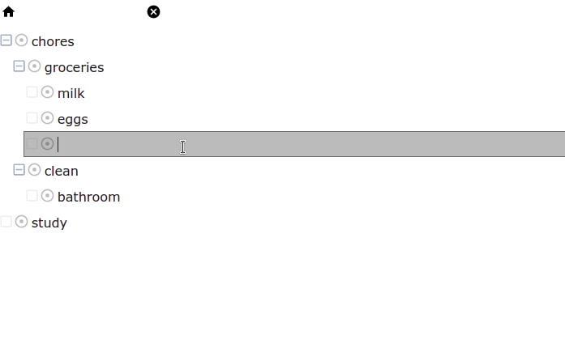

## Chkflow

---

Chkflow is a react component editor/view for tree and graph data structures inspired by workflowy's interface.




#### Integrate it into your react project:
```sh
yarn add chkflow
```

or

```sh
npm install -S chkflow
```

#### Usage:

Example usage with javascript:

```javascript
import './App.css';
import ChkFlow from 'chkflow';

function getNodes(){
  let savedNodes = window.localStorage.getItem('chkFlowNodes')

  if (savedNodes) {
    console.log('retrieved nodes')
    let nodes = JSON.parse(savedNodes)
    return nodes;
  }

}

function getEnv(){
  let savedEnv = window.localStorage.getItem('chkFlowEnvironment')
  if (savedEnv){
    console.log('retrieved environment')
    let environment = JSON.parse(savedEnv);
    return environment
  }
}


function setStateCallback(state){
  window.localStorage.setItem('chkFlowEnvironment', JSON.stringify(state.environment));
  window.localStorage.setItem('chkFlowNodes', JSON.stringify(state.nodes));
}

function App() {

  

  const nodes = getNodes();
  const environment = getEnv();
  const settings = {
    setStateCallback: setStateCallback,
    nodes: nodes,
    environment: environment
  }  


  return (
    <div className="App">
      <ChkFlow {...settings} />
    </div>
  );
}

export default App;


```

Example usage with typescript:
```typescript
import './App.css';
import ChkFlow from 'chkflow';
import type {
  ChkFlowEnvironment,
  ChkFlowNodes,
  ChkFlowSettings,
  ChkFlowState,
  ChkFlowNode
} from 'chkflow'

function getNodes(): ChkFlowNodes | undefined{
  let savedNodes = window.localStorage.getItem('chkFlowNodes')

  if (savedNodes) {
    console.log('retrieved nodes')
    let nodes = JSON.parse(savedNodes)
    return nodes;
  }

}

function getEnv(): ChkFlowEnvironment | undefined{
  let savedEnv = window.localStorage.getItem('chkFlowEnvironment')
  if (savedEnv){
    console.log('retrieved environment')
    let environment = JSON.parse(savedEnv);
    return environment
  }
}


function setStateCallback(state: ChkFlowState): void{
  window.localStorage.setItem('chkFlowEnvironment', JSON.stringify(state.environment));
  window.localStorage.setItem('chkFlowNodes', JSON.stringify(state.nodes));
}

function App() {

  

  const nodes = getNodes();
  const environment = getEnv();
  const settings: ChkFlowSettings = {
    setStateCallback: setStateCallback,
    nodes: nodes as ChkFlowNodes,
    environment: environment as ChkFlowEnvironment
  }  


  return (
    <div className="App">
      <ChkFlow {...settings} />
    </div>
  );
}

export default App;


```